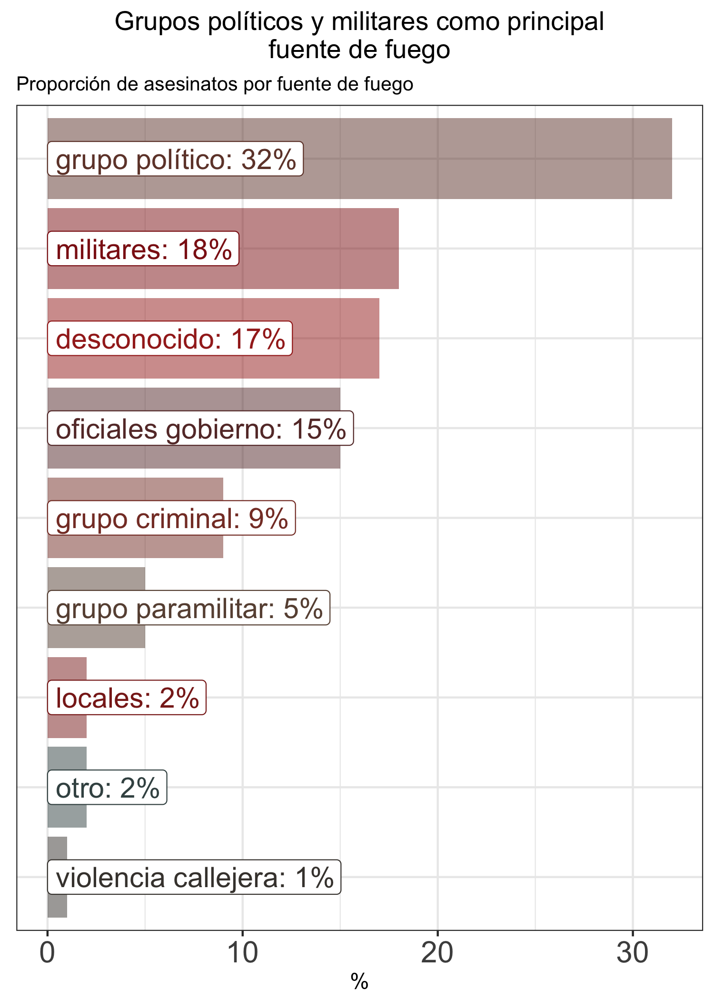
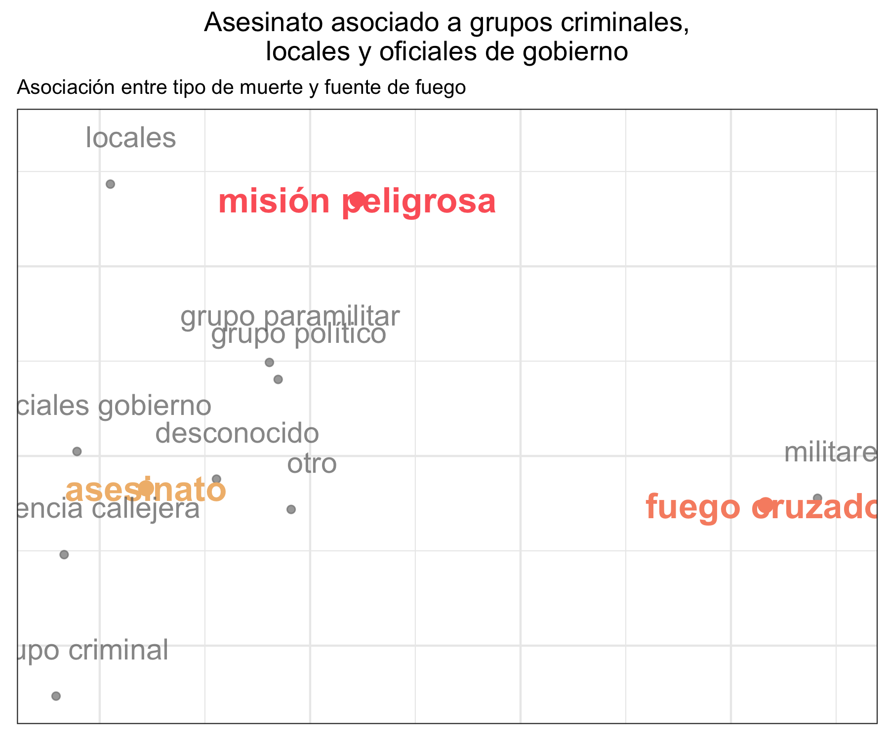
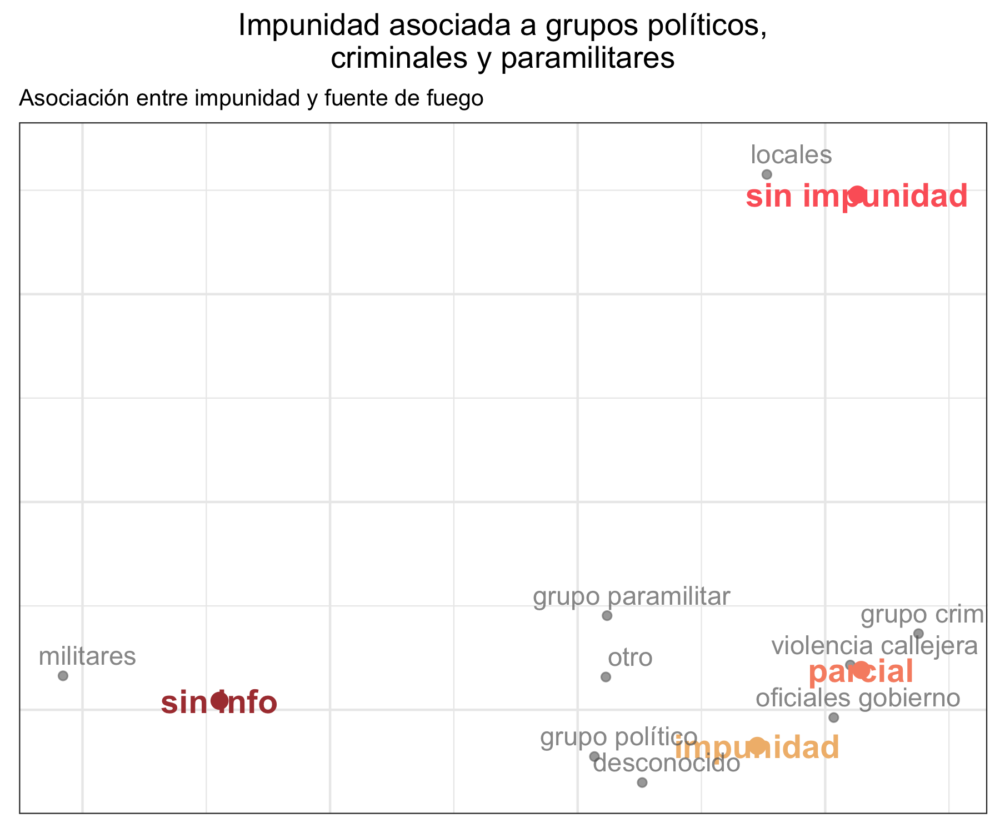
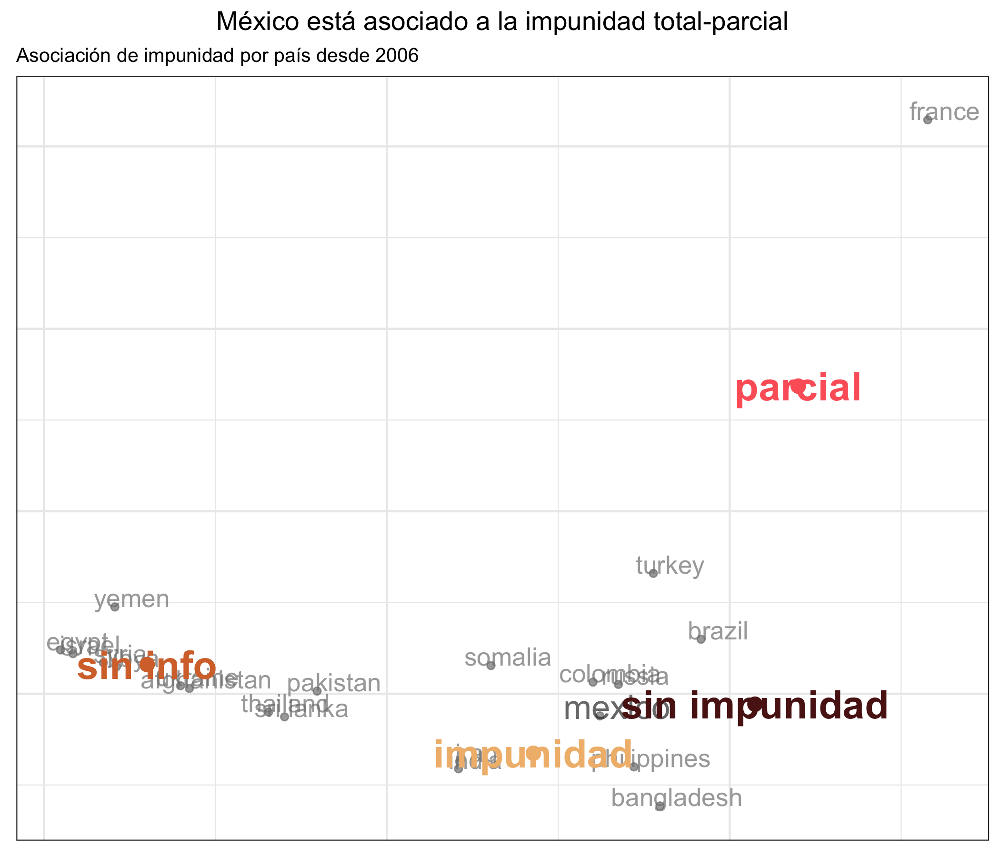

## En el recuento de los daños

Fuente: Journalists Killed since 1992 <https://cpj.org/>

Por: Centro de Análisis de Datos CAD 

---

A raíz de los conflictos sociales al rededor del mundo se ha observado 
un incremento en la amenaza a la libertad de expresión y libertad de prensa.

Intentaremos contestar preguntas sobre lo que pasa en el mundo y México. 

```{r setup, include=FALSE}
knitr::opts_chunk$set(echo = F, fig.pos = "center",
                      warning = F, message = F)
library(tidyverse)
library(xtable)
library(forcats)
library(ggplot2)
theme_set(theme_bw())
theme_update(plot.title = element_text(hjust = 0.5))
load("../cache/tab.motive.RData")
```


## ¿Cuántos han muerto?

En total hay 1212 periodistas asesinados desde 1992. 
En 2004 hubo un repunte en la agresión a periodistas
con niveles máximos en 2008 más de 70 periodistas asesinados. 

```{r, out.width='100%'}
knitr::include_graphics("../graphs/01_ww_trend.png")
```


----

## ¿Cómo se ve por país?


```{r}
knitr::include_graphics("../graphs/02_top15_pais.png")
```


```{r, out.width='100%'}
knitr::include_graphics("../graphs/mapas_eda/mapa_tot.png")
```


## ¿Qué está pasando?


```{r}
knitr::include_graphics("../graphs/03_prop_typedeath.png")
```


```{r}

```


```{r, out.width='100%'}

```


## ¿Se hizo algo?


```{r, out.width='100%'}

```


Monitoreo realizado por CPJ sobre el cumplimiento de la ley y el proceso legal para los casos de asesinato confirmado. Tiene tres niveles: yes, no, partial. 
El nivel *partial* se refiere a cuando algunos responsables son 
condenados pero no la totalidad.


----

## ¿Cambia el tipo de muerte por país?

```{r, out.width='100%'}
knitr::include_graphics("../graphs/typeofdeath/ca_cuatri_total.png")
```


----

## ¿Hay impunidad por país?

```{r, out.width='100%'}

```


----

## ¿Cómo se ve México?


```{r, out.width='100%'}
knitr::include_graphics("../graphs/sourcefire/source_typefire_mex.png")
```


---
El conjunto de datos presentado por el Comité para la Protección de Periodistas
(Committee to Protect Journalist CPJ) es
recolección de asesinatos de periodistas desde 1992 hasta marzo de 2017 
en aproximadamente 105 países. 

Únicamente se consideraron los asesinatos de periodístas con motivo
confirmado. Se descartó el asesinado de miembros del staff o ayudantes
como traductores. 
