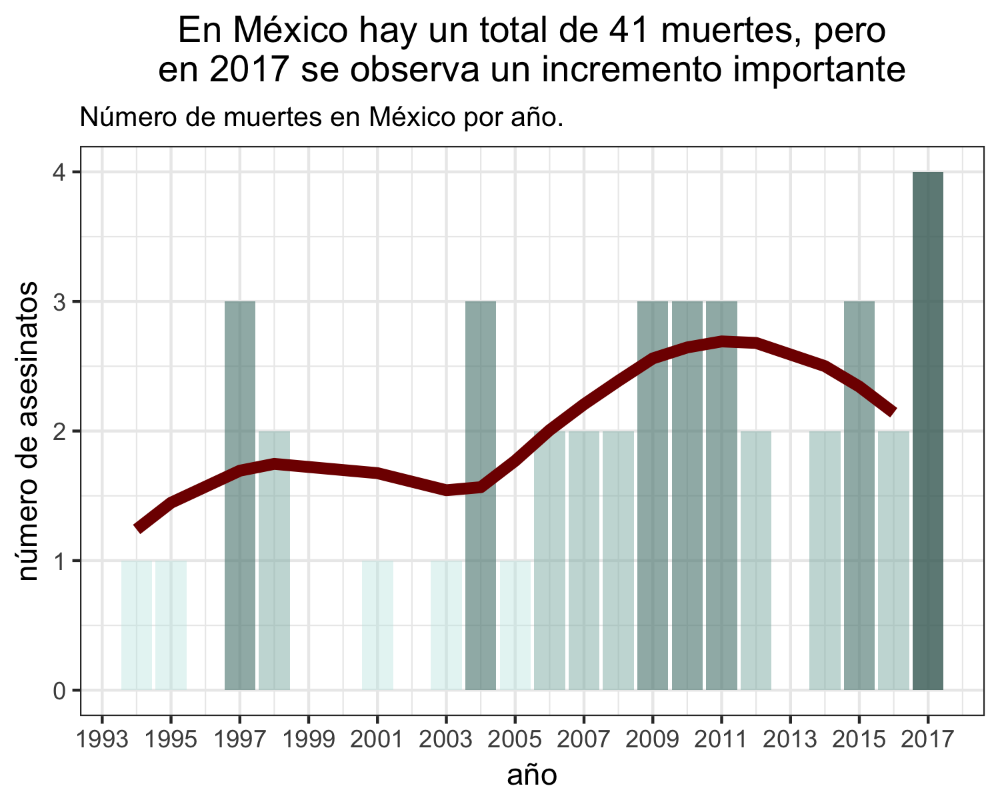

## En el recuento de los daños

Fuente: Journalists Killed since 1992 <https://cpj.org/>

Por: Centro de Análisis de Datos [CAD](https://github.com/Songeo/analisis_periodistas.git)

---

A raíz de los conflictos sociales al rededor del mundo se ha observado 
un incremento en la amenaza a la libertad de expresión y libertad de prensa.

Intentaremos contestar preguntas sobre lo que pasa en el mundo y México. 

```{r setup, include=FALSE}
knitr::opts_chunk$set(echo = F, fig.pos = "center",
                      warning = F, message = F)
library(tidyverse)
library(xtable)
library(forcats)
library(ggplot2)
theme_set(theme_bw())
theme_update(plot.title = element_text(hjust = 0.5))
load("../cache/tab.motive.RData")
```


## ¿Cuántos han muerto en el mundo?


```{r, out.width='100%'}
knitr::include_graphics("../graphs/01_ww_trend.png")
```

## ¿Y en México?


```{r, out.width='100%'}

```


----

## ¿Dónde está México?


```{r}
knitr::include_graphics("../graphs/02_top15_pais.png")
```


```{r, out.width='100%', eval=F}
knitr::include_graphics("../graphs/mapas_eda/mapa_tot.png")
```


## ¿Porqué se mueren?

```{r}
knitr::include_graphics("../graphs/03_prop_typedeath.png")
```


### ¿Tipo de Muerte?

```{r, out.width='100%'}
knitr::include_graphics("../graphs/typeofdeath/typed_ca_periodo_2.png")
```


### ¿Fuente de Fuego?

```{r, out.width='100%'}
knitr::include_graphics("../graphs/sourcefire/source_ca_periodo_2.png")
```


### ¿Impunidad?


```{r, out.width='100%'}

```


Monitoreo realizado por CPJ sobre el cumplimiento de la ley y el proceso legal para los casos de asesinato confirmado. Tiene tres niveles: impunidad, sin impunidad, parcial y sin información. 
El nivel *parcial* se refiere a cuando algunos responsables son 
condenados pero no la totalidad.


## ¿Quiénes están matando periodistas en México?

```{r, out.width='100%'}
knitr::include_graphics("../graphs/03_prop_sourcefire_mex.png")
```


## ¿Quienes salen impunes en México?

```{r, out.width='100%'}

```


---
El conjunto de datos presentado por el Comité para la Protección de Periodistas
(Committee to Protect Journalist CPJ) es
recolección de asesinatos de periodistas desde 1992 hasta marzo de 2017 
en aproximadamente 105 países. 

Únicamente se consideraron los asesinatos de periodístas con motivo
confirmado. Se descartó el asesinado de miembros del staff o ayudantes
como traductores. 
