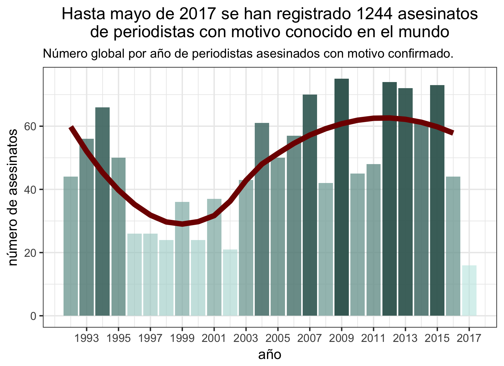

# En el recuento de los daños

Fuente: Journalists Killed since 1992 <https://cpj.org/>

Por: Centro de Análisis de Datos [CAD](https://github.com/Songeo/analisis_periodistas.git)

---

A raíz de los conflictos sociales alrededor del mundo se ha observado 
un incremento en la amenaza a la libertad de expresión y libertad de prensa.

Intentaremos contestar preguntas sobre lo que pasa en el mundo y en México.

```{r setup, include=FALSE}
knitr::opts_chunk$set(echo = F, fig.pos = "center",
                      warning = F, message = F)
library(tidyverse)
library(xtable)
library(forcats)
library(ggplot2)
theme_set(theme_bw())
theme_update(plot.title = element_text(hjust = 0.5))
load("../cache/tab.motive.RData")
```


### ¿Cuántos han muerto en el mundo?


```{r, out.width='100%'}

```

### ¿Y en México?


```{r, out.width='100%'}
knitr::include_graphics("../graphs/01_mex_trend.png")
```


### ¿Cuál es la causa de muerte?

```{r, out.width='80%'}

```


----

### ¿Dónde está México?


```{r}
knitr::include_graphics("../graphs/02_top15_pais.png")
```


```{r, out.width='100%', eval=F}
knitr::include_graphics("../graphs/mapas_eda/mapa_tot.png")
```


#### ¿Tipo de Muerte?

```{r, out.width='100%'}

```


#### ¿Fuente de Fuego?

```{r, out.width='100%'}

```


#### ¿Impunidad?


```{r, out.width='100%'}
knitr::include_graphics("../graphs/impunity/imp_ca_periodo_2.png")
```


Monitoreo realizado por CPJ sobre el cumplimiento de la ley y el proceso legal para los casos de asesinato confirmado. Tiene tres niveles: impunidad, sin impunidad, parcial y sin información. 
El nivel *parcial* se refiere a cuando algunos responsables son 
condenados pero no la totalidad.


### ¿Quiénes están matando periodistas en México?

```{r, out.width='100%'}

```


### ¿Quienes salen impunes en México?

```{r, out.width='100%'}
knitr::include_graphics("../graphs/sourcefire/source_impunity_mex.png")
```


---

### Conclusión


La democracia es un ideal universalmente reconocido y 
es uno de los valores fundamentales de las Naciones Unidas, organización 
de la que México es miembro. México al reconocerse como 
un país democrático tienen la responsabilidad y el compromiso 
de asegurar la libertad de expresión, enfatizando que éste
es un pilar de la democracia que asegura
el intercambio de ideas y opiniones en una sociedad plural. 

Sin embargo, podemos
observar que México ha fallado, tanto en garantizar la seguridad de
los periodistas al ocupar el noveno lugar con 
mayor asesinatos a nivel mundial, así como 
en procurar la justicia sobre los asesinatos al observarse 
una asociación del país a la impunidad total. 


Es cierto que el país 
se encuentra en una situación compleja ante un problema
complejo, pero como comentó Angela Merkel en su visita a México,
es vital que la 
libertad de expresión sea respetada, ya que citando a Christiane Amanpour:
*una batalla de información está en marcha en todo el mundo, 
y está evolucionando de manera extremadamente peligrosa*.


<br>
<br>

Fuente: 

<http://www.noroeste.com.mx/publicaciones/view/se_necesita_libertad_de_prensa_en_mexico_angela_merkel-1086600>

<http://www.un.org/en/sections/issues-depth/democracy/>

<https://cpj.org/2015/04/attacks-on-the-press-foreword.php>

<br>

---
El conjunto de datos presentado por el Comité para la Protección de Periodistas
(Committee to Protect Journalist CPJ) es
recolección de asesinatos de periodistas desde 1992 hasta mayo de 2017 
en aproximadamente 105 países. 

Únicamente se consideraron los asesinatos de periodistas con motivo
confirmado. Se descartó el asesinato de miembros del staff o ayudantes
como traductores. 
